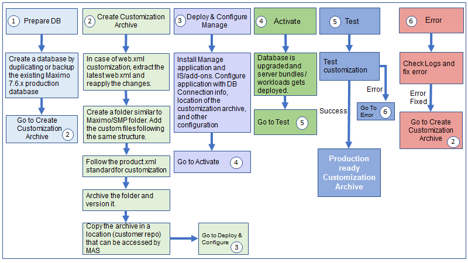

---
title: Customization Process
---           

The following diagram shows the customization process.

- Prepare DB:  Prepare test database as a duplicate of the existing Maximo production database.
- Customization Archive:  Create a customization archive by following the steps in the Customization Archive section.
- Deploy: Use MAS UI/API to configure the Manage, Industry Solutions/Add-Ons to point to the to be upgraded database, and other configurations.  Specify the location of the customization archive. Deploy the Manage application.
- Activate: Activate the Manage application. It will update the database and deploy workloads to the liberty containers.
- Test: Test, if any problem is found go to the next step and continue.
- Fix Error: Using the admin image container in the OpenShift env, copy the entire build directory to a local dev machine with the customization and compile. 
After fixing errors, create customization archive again with the updated code. Deploy and Activate the Manage application.

On successful testing, use the customization archive in the production environment.

### Product XML

Create Product xml for customization [#sampleproductxml](https://developer.ibm.com/static/site-id/155/maximodev/dbcguide/#_the_product_xml_file)

