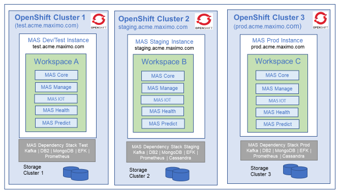

---
title: Deployment Model
---           

The following diagram shows a sample Manage deployment model.

- Each Cluster can run multiple MAS instances
-  Each instance runs its own set of pods and runtime code
- All instances within the cluster can share same license pool
- Each instance has its own workloads
 	- Worker nodes capacity management done per instance 
- Prerequisites stack is defined at instance level
- Independent storage clusters per instance