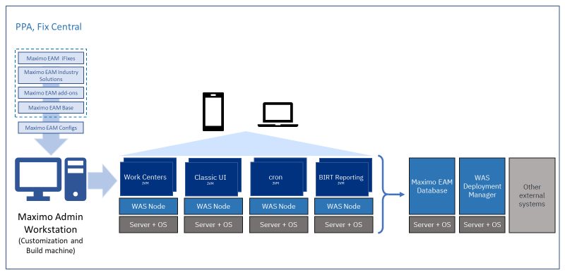

---
title: Maximo EAM 7.6 Deployment
---           

The following architectural diagram shows a typical Maximo 7.6 deployment.

In Maximo 7.6 deployment, the software gets downloaded on the admin workstation. The ear and war files are generated on the admin workstation and deployed on an application server. In this deployment example, the cluster is running multiple servers for Classic UI, Work Centers, Cron, and BIRT reporting to distribute the load in a WebSphere Network Deployment application server. The Maximo database and other external systems for integration are running on separate servers.