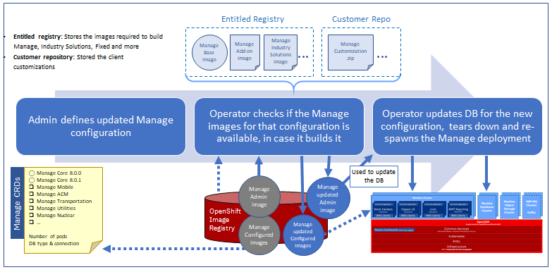

---
title: Manage Deployment Via Operator
---           

The following architectural diagram shows the Manage deployment via operator.

  
- **Create Custom Resource(CR):** An admin selects, configures, and deploys the Manage application. The deployment creates a Custom Resource (CR). A CR contains the user entered configuration for the application including the name, version, number of pods, and DB type and connection, type of workloads, location of customization archive, etc. 

- **Create Image:** The Manage operator gets images from the Entitled Registry and the customization archive (if exists) from the customer repository based on the information in the CR. The operator lays down the Industry Solutions/Add-on images and the customization archive over the Manage Base image to create the final images. It also validates against the dependency matrix. It creates a runnable Manage Admin image and the Manage configured images(workloads). The final images are stored in the Image Registry repository. 

- **Update Configuration:** The Manage Admin image installs (if the Manage database does not exist) or upgrades the Manage database for new configuration, tears down and re-spawns the Manage deployments.  Manage configured images (workloads) gets deployed to containers in MAS.