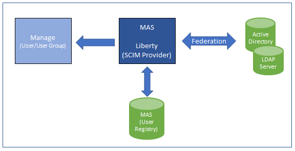

---
title: LDAP User Synchronization
---           

- MAS will synchronize users and groups from the LDAP server. There is no direct synchronization from LDAP to Manage.
- MAS will use WebSphere Liberty to synchronize with LDAP. Liberty provides a SCIM API for MAS to consume the data from LDAP repositories into MAS User Registry/IDP.
- MAS will consume the data from LDAP repositories into MAS User Registry/IDP.
SCIM defines the resource (Users/Groups) schema as well as the REST(CRUD) APIs to manage the resources.
- Customers can configure SCIM on LDAP to map extra attributes and they will be passed as an extension to Manage.
- The section tagged “extension” can include all extra attributes which are not part of default mapping.
- The schema attribute mapping can be customized using user exit (after), an automation script on user exit (after), or replacing the standard user exist (after) with JSON Mapper user exit (after).

The MAS sync process will consume user and user group information from SCIM APIs and update the MAS user registry. The Manage user sync process will pull the data from MAS and pushes it to Manage using MIF.