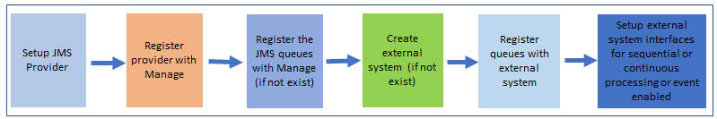
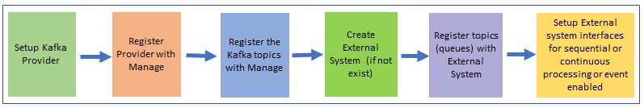

---
title: Integration
---           

 The API Key authentication is required for inbound HTTP/SOAP/REST-based integration to Manage. 

- The API Key needs be generated from the Administration Work Center.
- The HTTP request header must include the API Key.
- No other authentication including native authentication is supported. 

### Messaging Queues

- Migrate to Kafka or another supported provider (JMS 1.1) is required.
   - **JMS Provider**
       - Install/Provision/configure JMS provider (for example IBM MQ).
       - Register the JMS provider queues in Manage.
       - Associate the registered queues with the External Systems application. 
       - The queues and connection factories needs be registered in Manage in the server.xml file (Liberty) for the JMS provider. Follow the [Liberty documentation](https://www.ibm.com/support/knowledgecenter/SSEQTP_liberty/com.ibm.websphere.wlp.doc/ae/twlp_msg.html) for setup.

   - **Kafka**
      - Install/Provision/configure Kafka.
      - Register Kafka as a messaging provider in Manage. 
      - Register Kafka topics in Manage.
      - Associate the registered topics with the External Systems application. 
      - Kafka information link: [Kafka providers](https://www.ibm.com/support/knowledgecenter/SSLKT6_7.6.1.2/com.ibm.mif.doc/providers/c_mssg_providers_op.html)
      - Note: There is no text support for Kafka in the initial release. Only byte messages are supported. JMS supports both (text and byte).

- If already using a supported JMS provider (for example MQ)
	- The queues and connection factories should be registered in server.xml in Liberty server deployment using the same JNDI name as registered in the Manage.

The upgrade process will not move your current JMS integration messages. All messages in the queue and error table need to be processed and cleared before the upgrade.

File loading folders should be processed before the upgrade and will not be moved. 

  - You need to configure a volume mount during deployment.

 Web Services using SOAP 1.1 and 1.2 are supported. 

    
Remote Method Invocation (RMI) is replaced by REST API.

- RMI is not supported outside of the Maximo server process.
   - Security issues to the containers to open RMI ports.
   - Networking issues with K8s services and routes redirecting to RMI ports.
- Recommend customers to leverage Maximo REST APIs instead of RMI.
   - Maximo REST API follow open standards and are more secure and can be scaled.
   - Use of REST API with standard HTTP/s protocol helps make the client code language agnostic.
   - For REST APIs the Maximo API Key is used for authentication.
