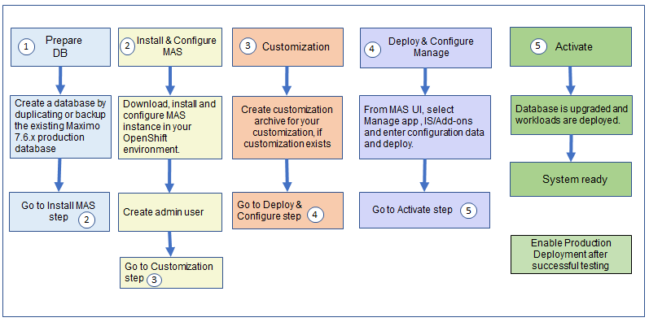

---
title: Upgrade Process
---           

The following diagram shows the upgrade process flow.

 

The upgrade process consists of test deployment and then production deployment on successful testing. The test deployment consists of five steps.
- **Prepare DB:**  Prepare test database as a duplicate of the existing Maximo production database.
- **Install & configure MAS:** Install and configure MAS instance in your OpenShift environment.
- **Customization:**  Create a customization archive by following the steps in the Customization Archive section (See Customization section for details).
- **Deploy:** Use MAS UI/API to configure Manage, Industry Solutions/Add-Ons to point to the to be upgraded database, and other configurations. Specify the location of the customization archive. Deploy Manage application.
- **Activate:** Activate Manage application. It will update the database and deploy workloads to the containers.

- Test and check the logs in case of errors. Fix errors. If the problem is related to customization, copy the entire build directory using the admin image container in the OpenShift environment to a local development machine with the customization and compile. After done, create the customization archive again with the updated code and redeploy and reactivate.

- On successful testing, deploy to production environment.

- **Production Deployment:** Configure OpenShift cluster, install MAS, and all prerequisites. Get all production configuration, database configuration, server bundles configurations, and customization archive if exists. Deploy and Activate the application. The system is production ready.

